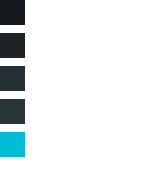

# Akio's ricing

Welcome to my ricing repository!

Please note that this repository exists only for me to keep my ricing in a safe place. **It is not meant to be used publicly (yet).** Yet, I'll leave this repository public as it can be a source of inspiration for some.

*If you are feeling adventurous you can try to use it still.*

### TODOs

- [ ] GTK Theme
- [ ] Qt Theme
- [ ] Make dark theme work (ffs)
- [ ] Installation helper script (using `config.json`)
- [ ] Screenshots (after theming)

### Packages

This is a list of package I'm using on my system for my ricing. Feel free to be picky, but you'll have to filter out configurations by yourself.

> I might actually have installed more and forgot to update the list, too. This will be an issue for the future me.

- **hyprland:** Main compositor of my rice
- **hyprshot:** Screenshot utility in hyprland
- **hyprpaper:** Display a custom wallpaper in hyprland
- **wofi:** Simple program to create menus
- **waybar:** Custom (task) bar for wayland
- **xdg-desktop-portal-gtk:** Enhance apps compatiblity with GTK
- **xdg-desktop-portal-hyprland:** Enhance apps compatiblity with hyprland
- **papirus-icon-theme-git:** Papirus Icon Set
- **neofetch:** Nice system info in CLI
- **noto-fonts:** The Noto Fonts
- **noto-fonts-cjk:** The Noto Fonts (CJK)
- **noto-fonts-emoji:** The Noto Fonts (Emojis)
- **alacritty:** Terminal Emulator
- **qt5ct:** Configuration integration for Qt5
- **qt6ct:** Configuration integration for Qt6
- **mako:** Desktop Notification Manager
- **playerctl:** Global controller for music players
- **brightnessctl:** Control laptop screen brightness
- **inotify-tools:** Watch for file change in a directory (used for waybar hot-reload)
- **montserrat-ttf:** The Montserrat font
- **fzf:** Nice option selector in terminal (used for advanced auto-completion with zsh)
- **thefuck:** I did a typo in my last command ? thefuck ?
- **bc:** Advanced math in terminal (because bash math sucks)

### Wallpaper

You can use the wallpaper freely, but it is **only for personal use**. If you use it in one of your rice, feel free to let me know :)

For info, this is my color scheme, heavily inspired by Adapta Nokto.



---

Below are just memos for future me
```
git clone --recurse-submodules https://github.com/alexpado/dots.git ~/.ricing
alias rice="~/.ricing/rice.sh"
```
